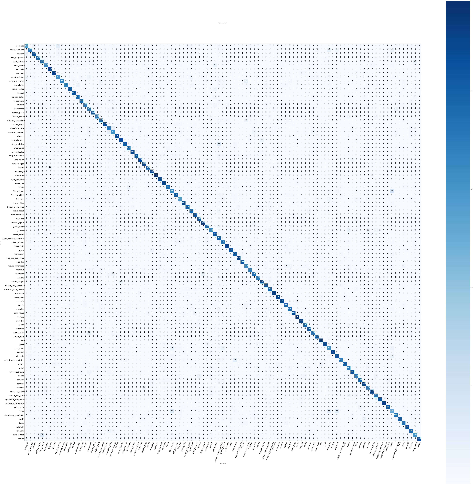
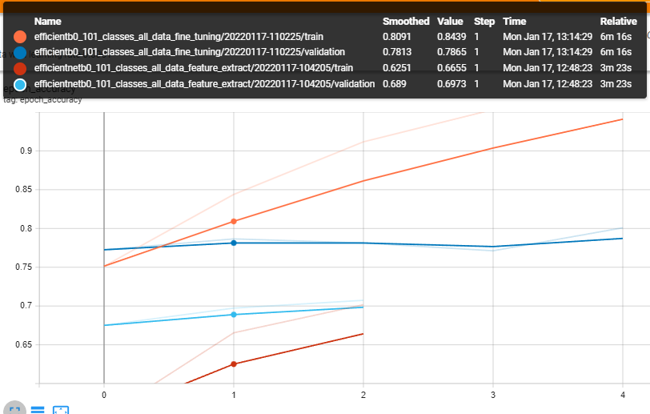
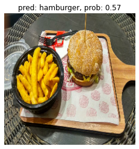
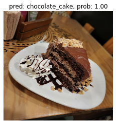
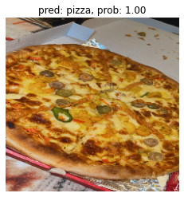

# -Food-Vision-

Building Food Vision™, using all of the data from the Food101 dataset and EfficientNetB0 model. The goal is to beat the results of DeepFood\*\*, a 2016 paper which used a Convolutional Neural Network trained for 2-3 days to achieve 77.4% top-1 accuracy.

## Confusion Matrix

## Accuracy % Loss from tensorboard

Full view at: [model's training curves on TensorBoard.dev](https://tensorboard.dev/experiment/u9inVWo3Rgy0b114b97DTQ/).

#### Accuracy:

#### Loss:

